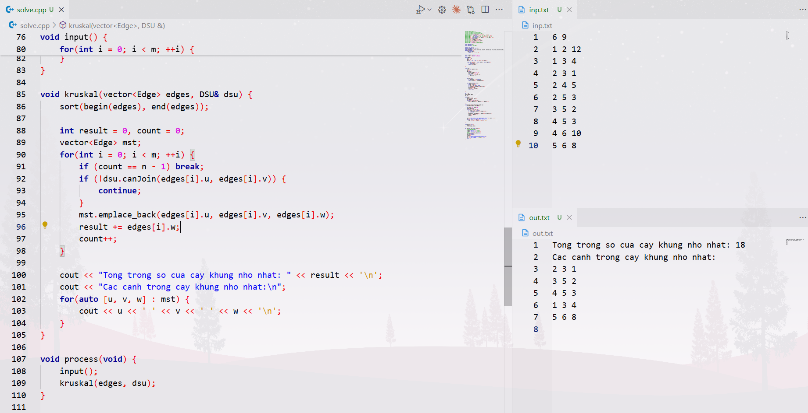

## Lấy code về máy

- Bước 1:

  - Truy cập vào **terminal**

- Bước 2:
  - Dán vào **terminal** đoạn code sau và thực thi nó
  ```
  git clone https://github.com/lamvc4869/kruskal-ai-nhom8.git
  ```

## Demo

Đầu tiên nên setup các file ra màn hình sao cho dễ nhìn rõ toàn bộ quá trình

Ví dụ (có thể tham khảo):



Tại file có đuôi là `.cpp` thực hiện tổ hợp phím `Ctrl + Alt + N` để tiến hành chạy chương trình.

Kết quả sẽ được hiện ra ở file `output.txt`

Testcase lấy từ trong file `test-case.txt` và dán vào trong file `input.txt`
